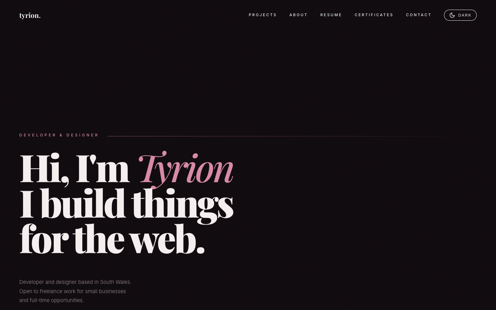

# Portfolio

This is my personal site, where I put my projects, my CV and my certificates in one place. I'm a developer and designer based in South Wales, and I care about how things look and how they feel to use, so I wanted the site itself to show that as well as describe it.



**Visit it at [tyrion.uk](https://tyrion.uk)**

## What's on it

- A home page with my featured projects, a bit about me and ways to get in touch.
- A projects page listing everything, with a separate write-up page for each project. Project cards can show a screenshot or a demo video, and project pages can have a gallery of extra screenshots.
- A CV page covering my experience, education and skills, with a PDF to download.
- A certificates page with an image of each certificate and a link to verify it.
- A menu for phones, a custom 404 page, and share previews for LinkedIn and other apps.
- A light and dark theme. It follows your system setting the first time you visit and remembers your choice after that.
- My [rigged tic-tac-toe game](https://github.com/TyrionRoseDev/annoying-tic-tac-toe), embedded on the home page. It picks up whichever theme the site is using. Beat it and you don't have to hire me.

## Built with

- [Astro 6](https://astro.build)
- Tailwind CSS 4 through its Vite plugin
- Astro content collections, with a schema for each collection

The site is fully static, so the build output is plain HTML, CSS and a little JavaScript.

## How the content works

Everything that changes regularly lives in Markdown under `src/content/`:

```
src/content/
  projects/       one file per project, with frontmatter for the card and a write-up in the body
  resume/         experience, education and skills for the CV page
  certificates/   one file per certificate
```

The schemas are in `src/content.config.ts`, so a missing or mistyped field fails the build. To add a project I create a new Markdown file in `src/content/projects/`, set `featured: true` if it should appear on the home page, and use `order` to control where it sits. A project can also have a `gallery` of extra screenshots (each with a `src` and `alt`), which show on its page and open full size when clicked, and `status: "in-progress"` to show an "In progress" badge. Projects with a demo `video` can set a `poster` image to show before it loads.

Project screenshots, certificate images and my photo live in `src/assets/` so Astro can resize them and serve AVIF/WebP. A project's `image` is a path relative to its Markdown file, for example `../../assets/projects/popcorn-screenshot.png`. Fonts are self-hosted from `src/assets/fonts/` (see `src/styles/fonts.css`). Other static files, such as the CV PDF, the demo video and the game (`public/game.html`), live in `public/`.

## Running it locally

You'll need Node.js 22.12 or newer.

```bash
npm install
npm run dev
```

The dev server runs at http://localhost:4321.

Other scripts:

```bash
npm run build     # build the static site into dist/
npm run preview   # preview the production build
```
